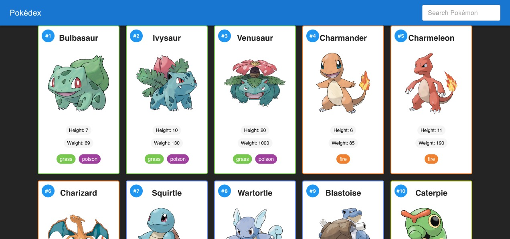
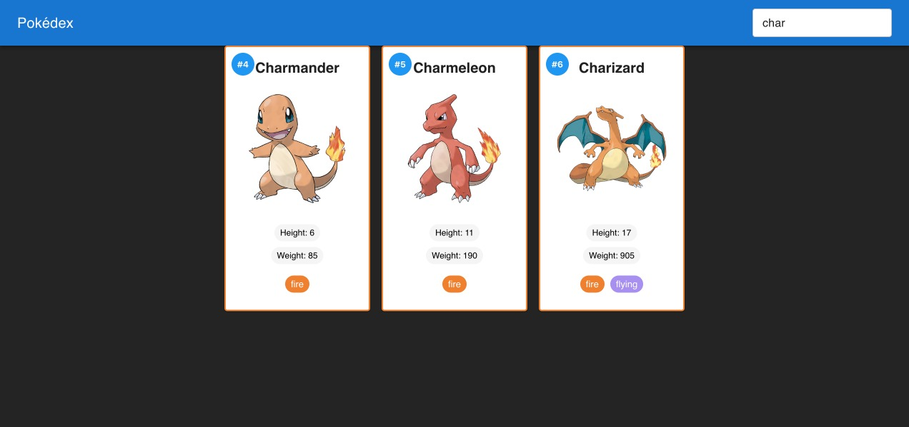
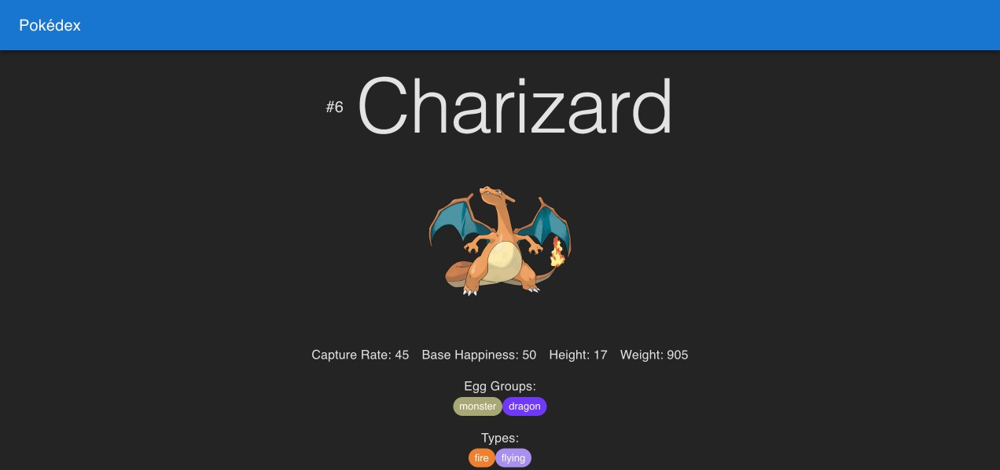

# Pokedex App

This Pokedex app allows users to browse and search for various Pokémon. Users can view detailed information about each Pokémon, including their height, weight, and types.

## Key Features

- **Browse Pokémon**: View a list of Pokémon with their images, names, heights, weights, and types.
- **Search Pokémon**: Use the search bar to find specific Pokémon by name or number.
- **Detailed View**: Click on a Pokémon to see more detailed information about it.

## Installation

To install and run this app on your own machine, follow these steps:

1. **Clone the repository**:
    ```sh
    git clone https://github.com/yourusername/pokedex-app.git
    cd pokedex-app
    ```

2. **Install dependencies**:
    ```sh
    npm install
    ```

3. **Run the app**:
    ```sh
    npm start
    ```

4. Open your browser and navigate to `http://localhost:3000` to view the app.

## Screenshots

### Home Page


### Search Functionality


### Detailed View


## Technologies Used

- React
- CSS
- JavaScript

## License

This project is licensed under the MIT License.

---

Feel free to contribute to this project by submitting issues or pull requests.
